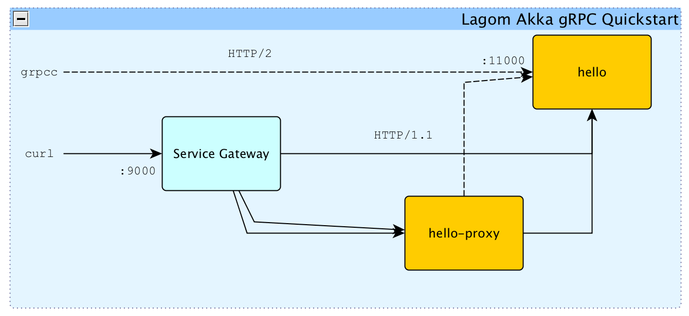

# Lagom gRPC Example (Scala)

[Lagom](https://www.lagomframework.com/) is an open source framework (built on [Akka](https://akka.io/) and [Play](https://www.playframework.com/)) for developing reactive microservice systems in Java or Scala.
[Akka gRPC](https://developer.lightbend.com/docs/akka-grpc/current/overview.html) is a toolkit for building streaming gRPC servers and clients on top of Akka Streams.

This Guide will show you how to use Akka gRPC as an alternate RPC library to communicate two microservices developed using Lagom.

## Downloading the example.

The Lagom gRPC Example is the [Lagom Samples GitHub repository](https://github.com/lagom/lagom-samples) that you can clone locally:

```bash
git clone https://github.com/lagom/lagom-samples.git
cd grpc-example/grpc-example-scala
```

## Running the example

Using gRPC in Lagom requires adding a Java Agent to the runtime. In order to handle this setting we provide a script that will
download the ALPN Java Agent and start an interactive `sbt` console properly set up. Use the `ssl-lagom`
script:

```
./ssl-lagom
```

The first time you run the script it will take some time to resolve and download some dependencies. Once
ready you'll be at the `sbt` console. Use the `runAll` command to start the Lagom gRPC Example:

```
sbt:lagom-scala-grpc-example> runAll
```

The `runAll` command starts Lagom in development mode. Once all the services are started you will see Lagom's start message:

```
...
[info] Service hello-proxy-impl listening for HTTP on 127.0.0.1:54328
[info] Service hello-proxy-impl listening for HTTPS on 127.0.0.1:65108
[info] Service hello-impl listening for HTTP on 127.0.0.1:65499
[info] Service hello-impl listening for HTTPS on 127.0.0.1:11000
[info] (Services started, press enter to stop and go back to the console...)
```

As soon as you see the message `[info] (Services started, press enter to stop and go back to the console...)` you
can proceed. On a separate terminal, try the application:

```bash
$ curl http://localhost:9000/proxy/rest-hello/Alice
Hi Alice!
$ curl http://localhost:9000/proxy/grpc-hello/Steve
Hi Steve! (gRPC)
```


## Application Structure

This application is built with two Lagom services (`hello` and `hello-proxy`) exposing the following endpoints:

```
GET /proxy/rest-hello/:id    # served by hello-proxy-service (HTTP-JSON)
GET /proxy/grpc-hello/:id    # served by hello-proxy-service (HTTP-JSON)
GET /api/hello/:id           # served by hello-service (HTTP-JSON)
```

And also

```
  /helloworld.GreetingsService/sayHello   # served by hello-service (gRPC)
```

We want to show how to use gRPC for service communication, so in this guide the services are
as simple as possible, with no other features. While the `hello-service` always returns hard-coded
values the `hello-proxy` always forwards the request downstream to `hello-service`.




So when you invoke:

```
$ curl http://localhost:9000/proxy/rest-hello/Alice
```

The following happens:

```
 curl  --(http)-->  service gateway  --(http)-->  hello-proxy-service  --(http)-->  hello-service
```

Alternatively:

```
$ curl http://localhost:9000/proxy/grpc-hello/Alice
```

The following happens

```
 curl  --(http)-->  service gateway  --(http)-->  hello-proxy-service  --(gRPC/https)-->  hello-service
```

## Testing the gRPC endpoints

The gRPC endpoints are not accessible via the Lagom Service Gateway so it's only possible to consume them from
another Lagom service or pointing a client directly to the `https - HTTP/2` port of the Lagom Service. Earlier we
saw that Lagom informs of the following bindings:

```
...
[info] Service hello-proxy-impl listening for HTTP on 127.0.0.1:54328
[info] Service hello-proxy-impl listening for HTTPS on 127.0.0.1:65108
[info] Service hello-impl listening for HTTP on 127.0.0.1:65499
[info] Service hello-impl listening for HTTPS on 127.0.0.1:11000
[info] (Services started, press enter to stop and go back to the console...)
```

You can test the gRPC endpoint using [grpcc](https://github.com/njpatel/grpcc). Because Lagom uses self-signed
certificates, you will have to export and trust the CA certificate:

```bash
keytool -export -alias playgeneratedCAtrusted -keystore target/dev-mode/generated.keystore  -storepass "" -file trustedCA.crt
openssl x509 -in  trustedCA.crt -out trustedCA.pem -inform DER -outform PEM
```

Once the CA certificate is extracted we can use `grpcc` to test the application:

```bash
$   grpcc --proto hello-impl/src/main/protobuf/helloworld.proto \
          --address localhost:11000 \
          --eval 'client.sayHello({name:"Katherine"}, printReply)' \
          --root_cert ./trustedCA.pem
 {
   "message": "Hi Katherine! (gRPC)"
 }
```

The command above:
 1. uses the gRPC description on `hello-impl/src/main/protobuf/helloworld.proto`,
 1. connects to the `hello-impl` service using `https` at `localhost:11000` (trusting the CA used to build the `localhost:11000` certificate), and
 1. sends a gRPC call `client.sayHello({name:"Katherine"},...)` (`grpcc` requires registering a callback, in this case `printReply` to send the response to the `stdout`).
